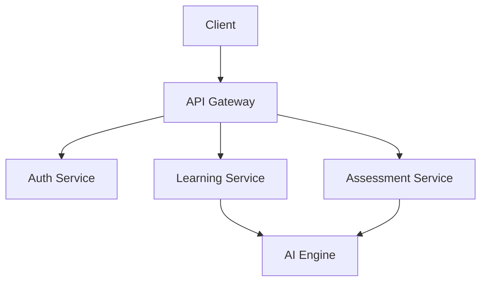
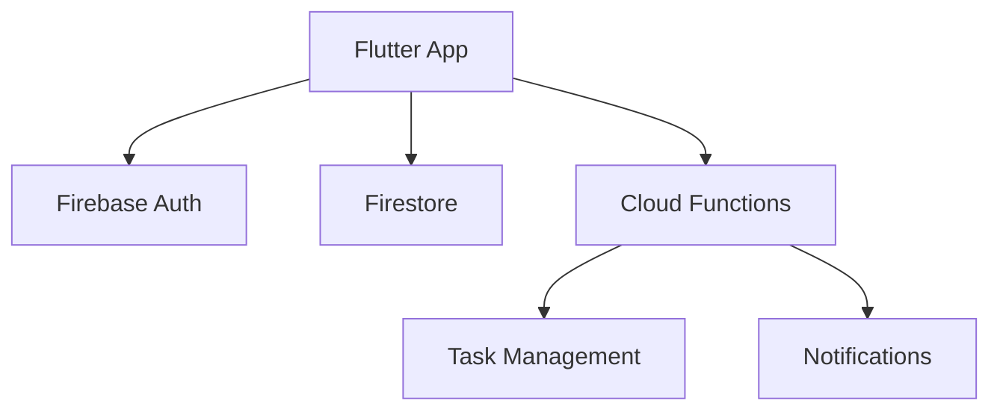
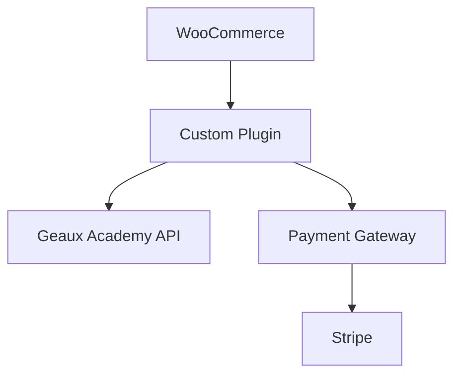

# Geaux Specialist LLC - Complete Documentation Suite

## Repository Structure
```
geaux-specialist/
├── docs/
│   ├── architecture/
│   ├── development/
│   └── deployment/
├── geaux-academy/
├── geaux-helped/
├── reanimated-echos/
├── geaux-emporium/
└── shared/
```

## Core Development Standards

### Version Control
- Git branch naming: `feature/`, `bugfix/`, `hotfix/`
- Commit messages follow Conventional Commits
- Pull request templates standardized across repos

### Code Quality
- Linting: ESLint, Black, Flutter Lint
- Testing: Jest, PyTest, Flutter Test
- CI/CD: GitHub Actions

### Documentation
Each project maintains three core documents:
- README.md: Project overview and setup
- CONTRIBUTING.md: Contribution guidelines
- DEVELOPMENT.md: Development workflow

## Project-Specific Documentation

### 1. Geaux Academy

#### System Architecture


#### Tech Stack
- Frontend: Next.js + TypeScript
- Backend: FastAPI + Node.js
- Database: PostgreSQL
- Cache: Redis
- AI: OpenAI GPT-4

#### Data Models
```prisma
model Student {
  id            String    @id @default(uuid())
  profile       Profile?
  assessments   Assessment[]
  progress      Progress[]
}

model Assessment {
  id            String    @id
  studentId     String
  type          AssessmentType
  results       Json
  createdAt     DateTime  @default(now())
}

model Curriculum {
  id            String    @id
  title         String
  content       Json
  adaptations   Json?
}
```

#### Security Implementation
```typescript
// Auth middleware
const authMiddleware = async (req: Request, res: Response, next: NextFunction) => {
  const token = extractToken(req);
  if (!token) {
    throw new UnauthorizedError();
  }
  
  const session = await validateSession(token);
  req.user = session.user;
  next();
};
```

### 2. Geaux HelpED

#### Mobile Architecture


#### Tech Stack
- Frontend: Flutter
- Backend: Firebase
- Database: Firestore
- Functions: Node.js

#### Data Models
```dart
class Patient {
  final String id;
  final String caregiverId;
  final Map<String, dynamic> profile;
  final List<Appointment> appointments;
  final List<Task> tasks;
}

class Task {
  final String id;
  final String patientId;
  final DateTime dueDate;
  final TaskPriority priority;
  final TaskStatus status;
}
```

### 3. ReanimatED Echos

#### Voice Processing Pipeline
```python
class VoiceProcessor:
    def __init__(self):
        self.whisper = WhisperModel()
        self.voice_encoder = VoiceEncoder()
        
    async def process_audio(self, audio_file: UploadFile) -> VoiceProfile:
        audio_data = await self.validate_and_normalize(audio_file)
        features = self.voice_encoder.encode(audio_data)
        return VoiceProfile(
            original_audio=audio_data,
            features=features,
            embedding=self.generate_embedding(features)
        )
```

#### Security Measures
```python
def secure_audio_storage(audio_file: UploadFile, user_id: str) -> str:
    """Store audio securely with encryption"""
    file_hash = generate_file_hash(audio_file)
    encrypted_file = encrypt_file(audio_file)
    
    return store_in_s3(
        bucket_name=f"voice-data-{ENV}",
        key=f"users/{user_id}/audio/{file_hash}",
        body=encrypted_file,
        encryption='AES256'
    )
```

### 4. Geaux Emporium

#### Integration Architecture


#### WordPress Configuration
```php
// Custom plugin integration
add_action('init', function() {
    add_rewrite_rule(
        'academy-content/([^/]+)/?$',
        'index.php?academy_content_id=$matches[1]',
        'top'
    );
});

// API integration
function geaux_academy_api_client() {
    return new GeauxAcademyClient(
        endpoint: getenv('ACADEMY_API_ENDPOINT'),
        apiKey: getenv('ACADEMY_API_KEY')
    );
}
```

## Shared Infrastructure

### Kubernetes Configuration
```yaml
apiVersion: apps/v1
kind: Deployment
metadata:
  name: api-gateway
spec:
  replicas: 3
  template:
    spec:
      containers:
        - name: gateway
          image: geaux/api-gateway:latest
          resources:
            requests:
              memory: "256Mi"
              cpu: "200m"
            limits:
              memory: "512Mi"
              cpu: "500m"
```

### Monitoring Setup
```yaml
apiVersion: monitoring.coreos.com/v1
kind: ServiceMonitor
metadata:
  name: api-monitor
spec:
  endpoints:
    - port: http
      interval: 15s
  selector:
    matchLabels:
      app: api-gateway
```

## Security Standards

### Authentication Flow
```typescript
interface AuthService {
  login(credentials: Credentials): Promise<Session>;
  validateSession(token: string): Promise<User>;
  refreshToken(refreshToken: string): Promise<Tokens>;
  revokeSession(sessionId: string): Promise<void>;
}
```

### Data Encryption
- AES-256 for data at rest
- TLS 1.3 for data in transit
- Key rotation every 90 days

## Scaling Strategy
- Horizontal pod autoscaling
- Database read replicas
- CDN for static content
- Redis for caching
